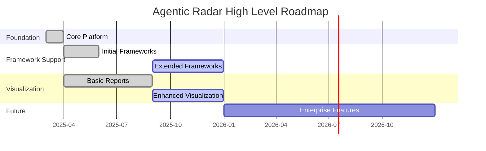
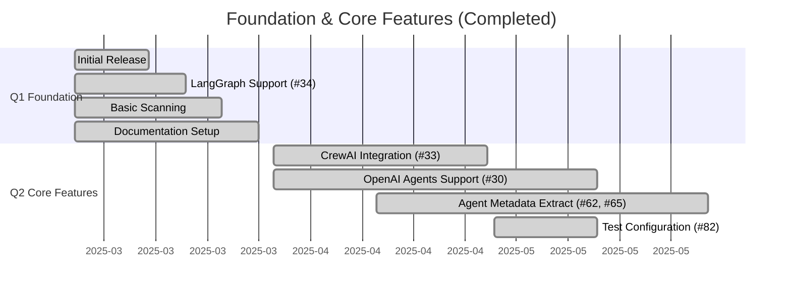
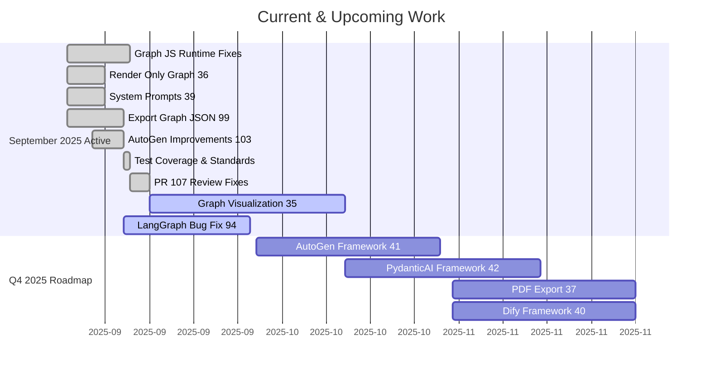
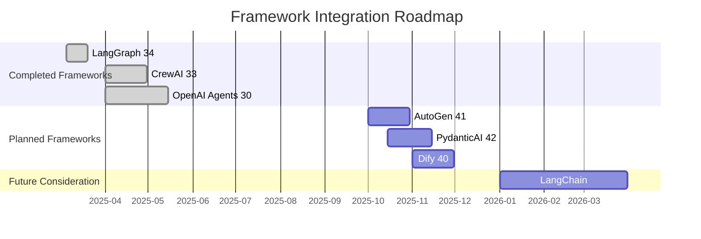

# Agentic Radar Development Timeline

This document provides a comprehensive view of the Agentic Radar project's development history and future roadmap.

## Project Overview
[Agentic Radar](https://github.com/splx-ai/agentic-radar) is a security scanner for agentic workflows, providing analysis, visualization, and vulnerability assessment for AI agent systems.

## Development Timeline

### Overall Project Timeline

### Completed Work (2025 Q1-Q2)

### Current Work & Near-Term Roadmap (2025 Q3-Q4)

### Framework Support Timeline

## Major Milestones

### Completed Milestones
- **March 2025**: Initial release with [LangGraph](https://langchain-ai.github.io/langgraph/) support ([#34](https://github.com/splx-ai/agentic-radar/issues/34))
- **April-May 2025**: [CrewAI](https://crewai.com/) integration ([#33](https://github.com/splx-ai/agentic-radar/issues/33)), [OpenAI Agents](https://platform.openai.com/docs/agents) support ([#30](https://github.com/splx-ai/agentic-radar/issues/30))
- **May 2025**: Agent metadata extraction ([#62](https://github.com/splx-ai/agentic-radar/issues/62), [#65](https://github.com/splx-ai/agentic-radar/issues/65)), test configuration ([#82](https://github.com/splx-ai/agentic-radar/issues/82))
- **September 2025**: Graph-only rendering ([#36](https://github.com/splx-ai/agentic-radar/issues/36)), system prompts section ([#39](https://github.com/splx-ai/agentic-radar/issues/39)), JSON export ([#99](https://github.com/splx-ai/agentic-radar/issues/99)), [AutoGen](https://autogen-ai.github.io/autogen/) improvements ([#103](https://github.com/splx-ai/agentic-radar/issues/103))

### Current Focus (September 2025)
- **[PR #107](https://github.com/splx-ai/agentic-radar/pull/107)**: Fixed JavaScript runtime errors and completed issues #36, #39 with comprehensive test coverage
- **[Issue #35](https://github.com/splx-ai/agentic-radar/issues/35)**: Graph visualization improvements still in progress (scaling, orientation, overlap reduction, styling)
- **[Issue #94](https://github.com/splx-ai/agentic-radar/issues/94)**: Fixing [LangGraph](https://langchain-ai.github.io/langgraph/) visualization bug (incomplete edge detection)
- Established [testing standards](testing-standards.md) for HTML+JavaScript components
- Addressed all PR review comments and improved test portability

### Active GitHub Issues (Open)
- **Framework Support**: [AutoGen](https://autogen-ai.github.io/autogen/) ([#41](https://github.com/splx-ai/agentic-radar/issues/41)), [PydanticAI](https://ai.pydantic.dev/) ([#42](https://github.com/splx-ai/agentic-radar/issues/42)), [Dify](https://dify.ai/) ([#40](https://github.com/splx-ai/agentic-radar/issues/40))
- **Export Features**: PDF export ([#37](https://github.com/splx-ai/agentic-radar/issues/37))
- **Visualization**: Graph improvements ([#35](https://github.com/splx-ai/agentic-radar/issues/35))
- **Bug Fixes**: [LangGraph](https://langchain-ai.github.io/langgraph/) [Langmanus agent](https://github.com/Darwin-lfl/langmanus) visualization ([#94](https://github.com/splx-ai/agentic-radar/issues/94))

### Upcoming Milestones
- **Q4 2025**: New framework integrations and export capabilities
- **Q1 2026**: Enterprise features and advanced analytics
- **Q2 2026**: Plugin ecosystem and cloud integration

## Development Phases

### Phase 1: Foundation (Complete)
- Core scanning capabilities
- Basic framework support ([LangGraph](https://langchain-ai.github.io/langgraph/))
- HTML report generation

### Phase 2: Framework Expansion (Complete)
- [CrewAI](https://crewai.com/), [OpenAI Agents](https://platform.openai.com/docs/agents), [AutoGen](https://autogen-ai.github.io/autogen/) support
- Tool and vulnerability detection
- [MCP server](https://modelcontextprotocol.io/) integration

### Phase 3: Advanced Security (In Progress)
- Runtime vulnerability testing
- Prompt hardening capabilities
- Enhanced visualization

### Phase 4: Enterprise & Scale (Planned)
- API development
- Cloud integration
- Advanced analytics and reporting
- Plugin architecture

## Technology Stack
- **Core**: [Python](https://python.org/), [PyPI](https://pypi.org/) packaging
- **Visualization**: [Mermaid](https://mermaid.js.org/), HTML/CSS/JS
- **Testing**: Runtime injection, [OpenAI](https://openai.com/) integration
- **Frameworks**: [LangGraph](https://langchain-ai.github.io/langgraph/), [CrewAI](https://crewai.com/), [OpenAI Agents](https://platform.openai.com/docs/agents), [AutoGen](https://autogen-ai.github.io/autogen/), [n8n](https://n8n.io/)